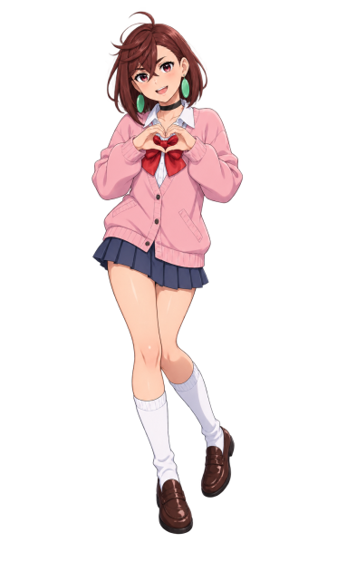

### Hi, I'm Ziliang! 👋

[Email: ziliangzhangcok@gmail.com](mailto:ziliangzhangcok@gmail.com)

### About Me

I am a second-year master’s student at the [Institute for Network Sciences and Cyberspace, Tsinghua University](https://www.insc.tsinghua.edu.cn/), advised by [Prof. Bo Wang](https://bowangthu.github.io/). My research focuses on **Stable Reinforcement Learning**, which aims to eliminate or mitigate inconsistencies between training and inference so that long-horizon reinforcement learning training remains stable and avoids collapse.

### My Skills

- [paper-reading-workflow](https://github.com/COK-ZhangZiliang/paper-reading-workflow)
- [Git-Rules](https://github.com/COK-ZhangZiliang/Git-Rules)

### Kaggle Competitions

- [Kaggriculture](https://github.com/COK-ZhangZiliang/Kaggriculture)
- [AI-Agent-Security](https://github.com/COK-ZhangZiliang/AI-Agent-Security)

 
