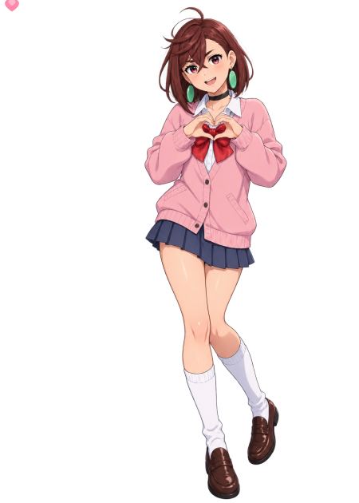

### Hi, I'm Ziliang! 👋

[Email: ziliangzhangcok@gmail.com](mailto:ziliangzhangcok@gmail.com)

### About Me

I am a second-year master’s student at the [Institute for Network Sciences and Cyberspace, Tsinghua University](https://www.insc.tsinghua.edu.cn/), advised by [Prof. Bo Wang](https://bowangthu.github.io/). My research focuses on **Stable Reinforcement Learning**, with the goal of mitigating discrepancies between training and inference, improving the stability of long-horizon reinforcement learning, and reducing the risk of training collapse.

| My Skills | Kaggle Competitions |
| --- | --- |
| [paper-reading-workflow](https://github.com/COK-ZhangZiliang/paper-reading-workflow) [Git-Rules](https://github.com/COK-ZhangZiliang/Git-Rules) | [Kaggriculture](https://github.com/COK-ZhangZiliang/Kaggriculture) [AI-Agent-Security](https://github.com/COK-ZhangZiliang/AI-Agent-Security) |

 
